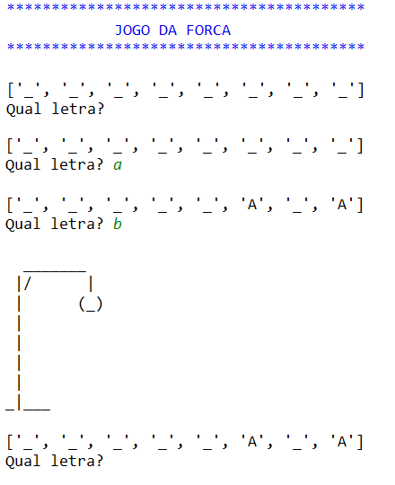
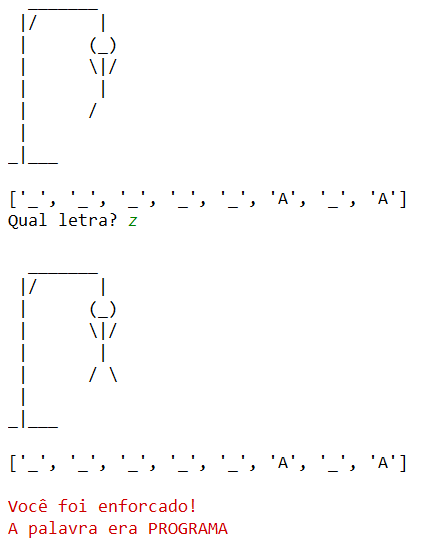
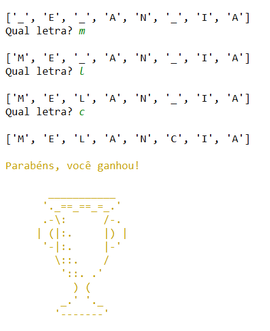

# Jogo da Forca com Python

### 📚  Descrição

O jogo da forca é um jogo em que o usuário tem que acertar qual é a palavra secreta, tendo como dica o número de letras representado pelos traços em branco. 
A palavra secreta é sorteada da lista do arquivo *palavras.txt*.

&nbsp;

&nbsp;

A cada letra errada, é desenhado uma parte do corpo do enforcado. O jogo termina ou com o acerto da palavra ou com o término do preenchimento das partes corpóreas do enforcado. 

Quando o usuário perde:

&nbsp;

Quando o usuário ganha:

### 🖥️  Recursos Utilizados

- [Python](https://www.python.org/)
- [Pycharm - Community](https://www.jetbrains.com/pt-br/pycharm/download/)

&nbsp;

